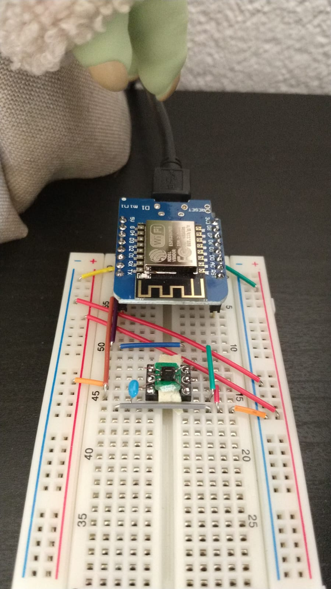

# Home humidity/temperature sensor

Originally to be written in [Rust/Embassy](https://embassy.dev/). But until we have better support for ESP8266 WiFi or I get another controller, it's written with Arduino... 

